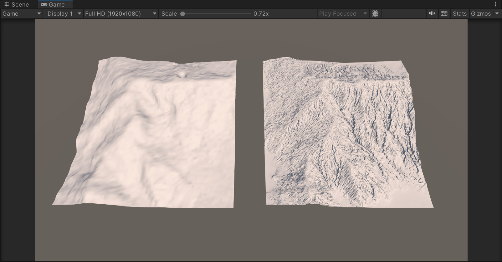
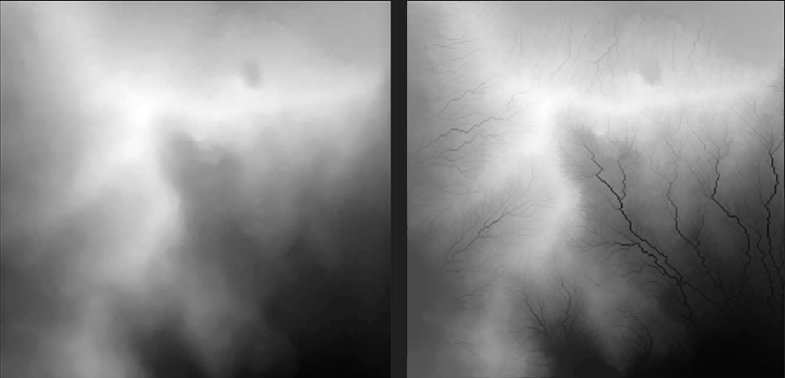
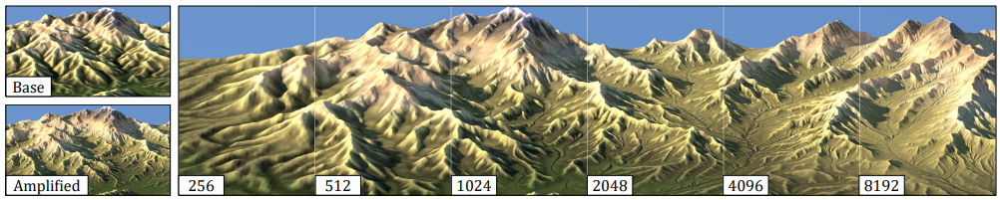
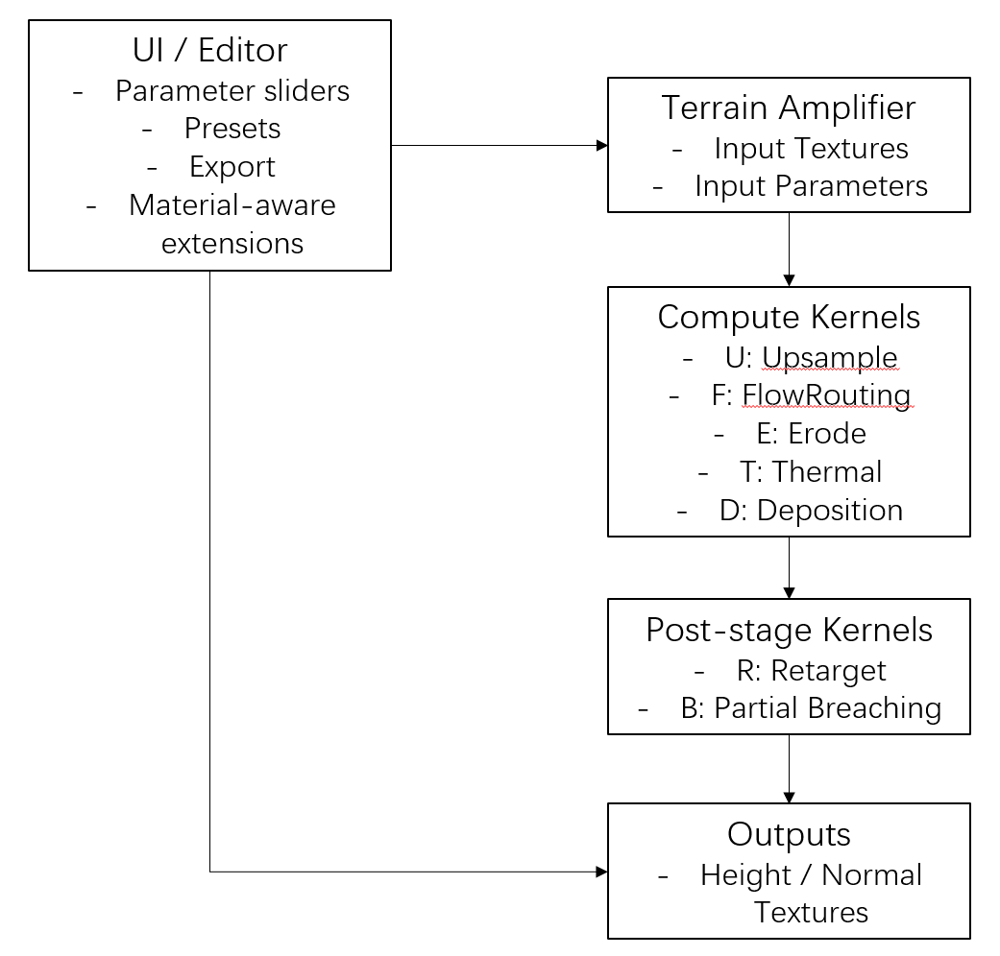

# CIS 5660 Final Project

Team members: Zixiao Wang, Tianhong Zhou

## Milestone #1

### Progress

We've successfully implemented and reproduced the multi-scale hydraulic erosion algorithm described in the original paper. The core compute-shader stages, including Flow Routing, Erosion, Thermal Relaxation, Deposition, Retargeting, and Breaching, are now functional in Unity and produce results consistent with the reference implementation. We have also confirmed the correctness of our pipeline scheduling (upsampling, buffer swapping, and multi-level execution). The terrain evolution behaves as expected under controlled test parameters, and we can visualize intermediate heightmaps directly through Unity's GPU readback for debugging and validation.

### Results

Comparison between base height map (256 * 256) and generated height map (2048 * 2048)

## Design Doc

#### Introduction
High-resolution, hydrologically consistent terrains are expensive to author by hand and slow to simulate at full resolution. [Terrain Amplification using Multi-scale Erosion](https://hal.science/hal-04565030/document) (SIGGRAPH 2024) proposes a fast pipeline that amplifies a coarse DEM into a detailed terrain across scales while keeping drainage networks realistic. We will reproduce that pipeline in Unity (Compute Shaders) and extend it with material-aware erosion (e.g., rock vs. soil vs. snow/ice) so results feel more geographic and controllable for artists.

#### Goal
1. Reproduction of the paper's multi-scale amplification pipeline: upsample -> stream-power erosion -> thermal relaxation -> deposition -> ridge/peak retargeting -> multi-scale partial breaching.

2. Authoring tool in Unity: real-time controls (sliders/brush), visual debugging layers (slope, drainage area, hardness, sediment), and one-click export of heightmap/normal/albedo.

3. Material-aware extension beyond the paper: spatially varying erodibility and process parameters so that rocky cliffs, loose soil, and snow/ice evolve differently.

#### Inspiration/reference:

- [Terrain Amplification using Multi-scale Erosion](https://hal.science/hal-04565030/document), SIGGRAPH 2024. (Schott, Galin, Guérin, Peytavie, Paris)
- [WebGL Erosion](https://github.com/LanLou123/Webgl-Erosion)

#### Specification:

Core features (paper parity)

- Input: heightmap (coarse DEM or sketch).

- Multi-scale amplification operator Ak = Dk o Tk o Ek o Uk:
  - U: bicubic upsampling per level.

  - E: stream-power erosion with clamping, hardness, and few iterations per level.

  - T: thermal relaxation with critical slope (talus) threshold.

  - D: capacity-like deposition, mass-conserving transport along the same flow routing.

- Ridge/peak retargeting to preserve large-scale silhouette (constraint-guided diffusion of error field).

- Multi-scale partial breaching to remove spurious pits without 1-pixel canyons.

Material-aware extensions (beyond paper)

- Material map over terrain cells with labels: ROCK, SOIL, SNOW/ICE (artist-painted or procedurally classified by slope/altitude/curvature).

- Per-material parameter sets:

  - Stream-power exponents and coefficient.

  - Talus angle higher for rock (steeper stable slopes), lower for soil/snow.

  - Deposition rates varying with material and local slope/wetness.
  
  - ......

#### Techniques:
- Platform: Unity. We will implement the pipeline with HLSL Compute Shaders, RenderTextures (RFloat/RGHalf), and CommandBuffers in a ping-pong schedule, using Unity for live parameter tuning, debug overlays, and export of height/normal/splat maps.
- Algorithm: Follow the algorithm in [Terrain Amplification using Multi-scale Erosion](https://hal.science/hal-04565030/document).

#### Design:

#### Timeline:
- Week1: Paper reproduction
  - Zixiao Wang: T, D in compute kernels & R in post-stage kernels.
  - Tianhong Zhou: Basic setup & U, F, E in compute kernels & B in post-stage kernels.
- Week2: Material extensions
  - Zixiao Wang: Material system: material map authoring/IO (rock/soil/snow), per-material LUTs for (n, m, ke, talus, kc, kd).
  - Tianhong Zhou: Material-aware erosion wiring: read material at runtime, blend parameters.
- Week3: Editor interactions
  - Zixiao Wang: Presets (Alpine / Sandstone / Snowy), comparison view (input vs amplified), screenshot/record utility.
  - Tianhong Zhou: Material behaviors: tune rock vs soil vs snow (talus angles, ke scaling, optional glacial-like broadening).
- Week4: Final polish
  - Zixiao Wang: Parameter tuning per level; stability checks; small UX touches (tooltips, reset buttons).
  - Tianhong Zhou: Visual polish: normals/splat export, look presets, camera paths; tidy overlays (flow dirs).
