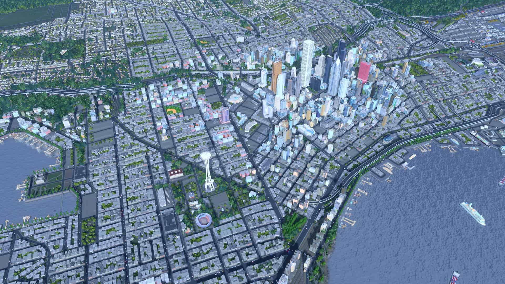
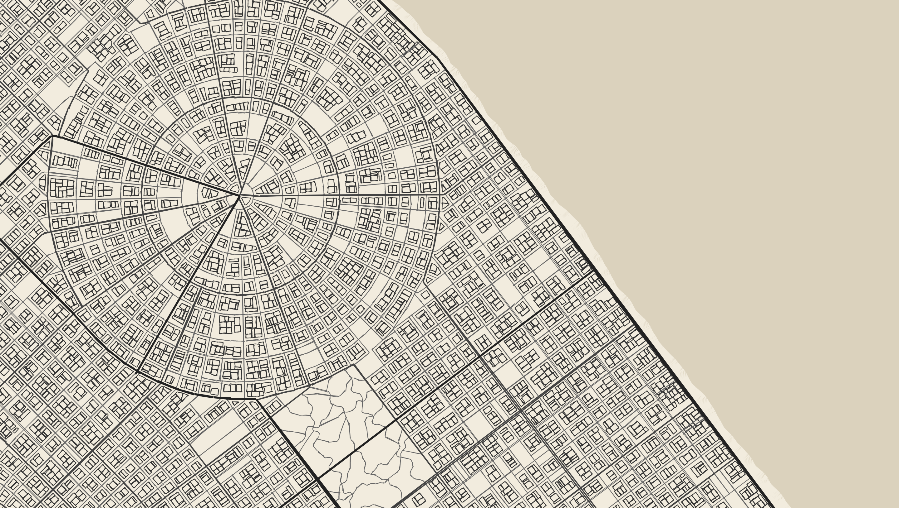

# Final Project!

### Design Doc

#### Introduction
- After learning how to procedurally build a house in Houdini in my previous homework project, I began thinking about generating other structures procedurally. I considered what types of things can be procedurally generated and what kind of scene would best showcase procedurally built structures. This led me to the idea of procedurally generating a city.

#### Goal
- The goal is to procedurally generate a city using Houdini.

#### Inspiration/reference:
- Pictures:
    - 
    - 
- Videos:
    - [Procedural City](https://www.youtube.com/watch?v=xRqlCYz4I6I)
    - [City Generator](https://www.youtube.com/watch?v=ligKs9aXKsA)

#### Specification:
- Procedurally generate layout of the city.
- Generate roads and buildings based on the layout.
- Optional: other urban features like grass and trees, people and cars

#### Techniques:
- Houdini (the software to use)
- Noise functions and other toolbox functions
- Other procedural tools, such as L-systems

#### Design:
- `generation engine` $\rightarrow$ `city's layout` $\downarrow$
- `components of roads and buildings` $\longrightarrow$ `procedurally generated city`

#### Timeline:
- Week 1: Prepare materials and components, such as basic building models and road systems. Create a simple demo to explore combinations of different road layouts and buildings.
- Week 2: Develop the procedural generation engine for basic structures.
- Week 3: Refine the city generation by adding roads and buildings. Test and optimize the engine.
- Week 4: Finalize the project, addressing any remaining issues and removing unfinished elements.