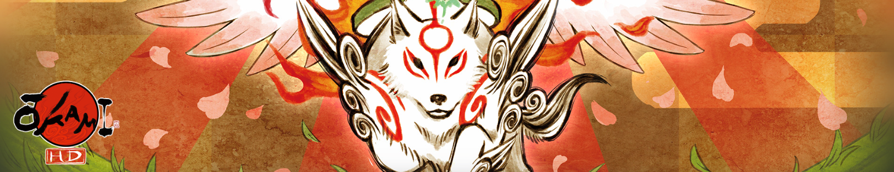
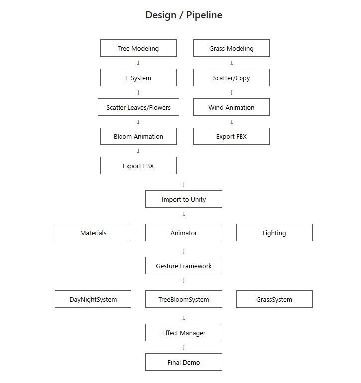

# Amaterasu's Brush: Interactive Nature Restoration

## CIS 566 Final Project Design Document

Muqiao Lei

---

---

## Introduction

This project extends the Mix and Jam Celestial Brush project. The original project implements a gesture recognition system, and I will add actual visual effects on top of it.

I will use Houdini to create assets like tree blooming and grass growth, then import them into Unity so gestures can trigger these effects. I will also implement a day/night transition system.

---

## Goal

Extend the existing Mix and Jam Celestial Brush project with the following features:

1. **Day/Night Control** - Draw sun/moon to transition sky colors and lighting
2. **Tree Blooming** - Draw on dead trees to trigger blooming and leaf growth effects
3. **Grass Generation** (optional, if time permits) - Draw on ground to spawn grass

---

## Inspirations and References

**Primary Reference - Mix and Jam Celestial Brush:**

- GitHub: https://github.com/mixandjam/Okami-Celestial-Brush
- Video: https://www.youtube.com/watch?v=yuQXeaYBuuM
- **Usage**: Foundation for gesture recognition and input handling

**Original Game - Okami:**

- Bloom technique: reviving dead trees
- Sunrise technique: controlling day/night

**Houdini Technical References:**

- L-system for plant generation
- Animation and growth effects

---

## Specifications

### Core Features:

**1. Day/Night System**

- Recognize sun/moon gestures
- Sky color transitions
- Lighting changes

**2. Tree Blooming System**

- Detect circle gesture on dead trees
- Play tree blooming animation:
  - Dead tree turns green
  - Leaves grow
  - Flowers bloom

**3. Grass System** (if I have time left)

- Detect ground brush strokes
- Generate grass

---

## Techniques

### Workflow:

**Houdini:**

- Create tree/plant models
- Use L-system or other tools to generate plants
- Create blooming/growing animations
- Export to Unity

**Unity:**

- Import Houdini assets
- Connect gesture recognition to effect triggers
- Handle day/night lighting changes

---

## Design

**Workflow:**

Houdini Production:

- Tree modeling → L-System → Scatter leaves/flowers → Bloom animation → Export FBX
- Grass modeling → Scatter/Copy → Wind animation → Export FBX

Unity Integration:

- Import assets → Setup materials/animation/lighting
- Connect to gesture framework
- Implement three systems: DayNightSystem, TreeBloomSystem, GrassSystem
- Effect Manager for unified control
- Final Demo

---

## Timeline

### Milestone 1 (11/5 - 11/12):

**Goals:**

- Familiarize with Mix and Jam project
- Implement day/night system
- Learning Houdini plant creation and growing animation

**Deliverables:**

- Day/night transitions working

---

### Milestone 2 (11/12 - 11/24):

**Goals:**

- Create effects in Houdini
- Import to Unity
- Connect gesture triggers

**Deliverables:**

- Draw circle on tree triggers blooming
- Animations play correctly

---

### Milestone 3 (11/24 - 12/1):

**Goals:**

- Polish effects
- Grass system (if time allows)
- Record video

**Deliverables:**

- Complete demo
- Showcase video

---
